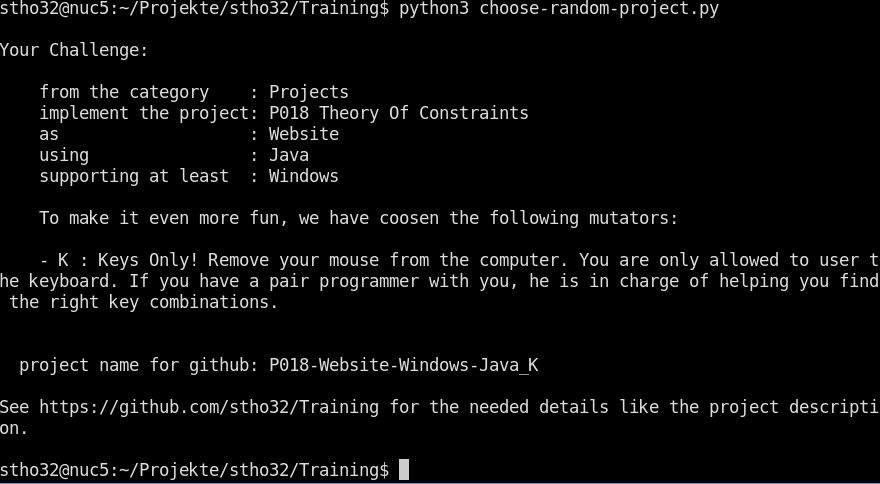

# Developer Training Program :mortar_board:

This is a repository dedicated to coding training. 
Essentially it is a collection of requirement sets for projects. It also contains a python script `choose-random-project.py` which will help you to randomly select a challenge, programming language, project type and some mutators.

1. [Foreword](Foreword.md)

2. Training Projects

    1. [Environment / Base Projects](BaseProjects/README.md)

    2. [Tool Projects](ToolProjects/README.md)

    3. [Product simulating projects](Projects/README.md)

3. [Attachments](Attachments.md)

----

## additional ideas to make the training more effective and fun

- Remove your mouse from the computer. Let us see if you are good enough to do the challenge keyboard only.
- Implement the same project multiple times. Measure the time needed. In every iteration try to finish in half the time.

## degrees of maturity for any task / project

- Level 1: We did the task somehow. It works now. 
- Level 2: We did the task in below 1 hour.
- Level 3: All information for doing the task was already available. We did not need to use google or search around anywhere else.
- Level 4: The task was done during regular working hours.
- Level 5: We planned to do this task at this time.

## Developer Levels

- Level 1: Tinkering around, mostly using google, copying stuff, maybe did a first tutorial
- Level 2: Did grasp the basic concepts: variables, loops, ...
- Level 3: Has created a first project of his own, that is something he/she can personally use, all by him-/herself.
- Level 4: Grasped classes and inheritance, did code at least 10 projects including classes, some of them are libraries to use with other projects.
- Level 5: Can read and work with other peoples code. 
- Level 6: Has an understanding of the SOLID principles and uses object oriented design.
- Level 7: Uses the principles and unit tests to create understandable code that can be used and maintained by others.
- Level 8: Finds a new technology, methodology or something else and goes back to Level 1.

## Algorithm based training

- https://www.hackerrank.com/
- https://www.codewars.com/
- https://leetcode.com/ (e.g. https://leetcode.com/problems/maximum-subarray/)

## Security

- https://tryhackme.com/hacktivities

## Priorisation Techniques

- User Story
- EFP
- Logic Tree
- Kanban

